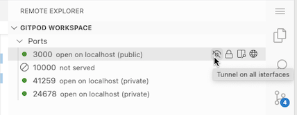

<script context="module">
  export const prerender = true;
</script>

### Connecting to your workspaces

While Gitpod can seamlessly integrate into your workflow in the vast majority of cases, there are times where you may want to access a workspace from outside its confines. While this has been possible using the existing VS Code port forwarding feature, it only worked for an HTPP-based protocol.

Gitpod is pleased to announce a preview release of the _Gitpod Local Companion_ app that is designed to allow localhost access to any TCP port in a remote workspace regardless of protocol.

The app is intended to run locally and enables automatically tunneled connections to your workspace, either privately or, if required, publicly (on your laptops IP for example).

This opens up any environment or framework that assumes localhost access. Also linking to http://localhost:5000 in your projects README.md will now _just work_ for anyone clicking on the _Gitpod_ button on your project.

As a preview release, not all of the features are implemented, most notably the tunneling is 1-way only: local -> workspace.
Of course, we have big plans! Future features may include:

- Listing what workspaces are running
- Listing what ports are currently tunneled and in which direction (workspace to/from local)
- Starting/stopping port forwarding from the command line
- Connecting a local VS Code instance to a workspace
- SSH into a workspace from the command line in a simple, straight forward way

We love feedback here at Gitpod so please give it a try and let us know what you think!

#### Installation

To get started, download the preview release of the _Gitpod Local Companion_ app for your platform:

```
  # mac
  curl -OL https://gitpod.io/static/bin/gitpod-local-companion-darwin
  # linux
  curl -OL https://gitpod.io/static/bin/gitpod-local-companion-linux
  # windows
  curl -OL https://gitpod.io/static/bin/gitpod-local-companion-windows

  chmod +x ./gitpod-local-companion-*
```

#### Running

To run it using your local keyring for long term storage of the access token:

```
  GITPOD_HOST=https://gitpod.io ./gitpod-local-companion-[darwin|linux|windows]


```

To run it without storing the access token (it will generate a new token every time);

```
  GITPOD_HOST=https://gitpod.io ./gitpod-local-companion-[darwin|linux|windows] --mock-keyring


```

If you are not logged in to Gitpod, it will take you through that flow. If you haven't run the local app previously it will also ask you to approve access to the control data of all your workspaces, returning a token that grants the access. This token will be stored in your local keyring for future use (unless you specify otherwise).

Once approval has been granted it will connect to your currently active workspaces and allow VSCode to control the tunnelling between the remote workspace and your local environment using the standard VSCode Ports View.

#### Extended VSCode Ports View

Gitpod has extended the existing VSCode Ports view to allow additional control of how the ports are exposed. As shown below there is an additional toggle on each port to switch between _Tunnel on localhost_ exposure i.e. nothing outside of your laptop



and _Tunnel on all interfaces_ to make that port available on 0.0.0.0. and, depending on your firewall settings, to anyone that can access your laptop externally.


#### SSH Access

Additionally, the _Gitpod Local Companion_ preview release also has basic support for SSH access into your workspace. It currently requires that you have a default SSH key setup in the ~/.ssh directory i.e. id_rsa.pub & id_rsa. The public key will be copied to the workspace to permit access.

This opens up all the usual SSH-based features, such as secure copying, tunneling and remote execution.

Once you have installed the _Gitpod Local Companion_ app and connected it to your workspaces, it dynamically creates entries for each workspace in the /tmp/gitpod_ssh_config file. You can use this to SSH into your workspace as follows:

```
ssh -F /tmp/gitpod_ssh_config <your-workspace-id e.g.apricot-harrier-####>


```

You will be prompted to add the address to your known hosts file and you will be connected to your workspace!
